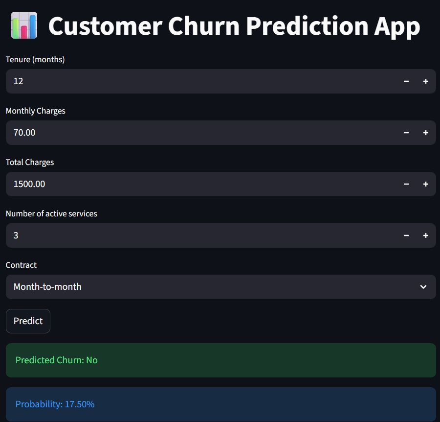

# Churn-project
Telco Customer Churn Prediction -Python ML Project
# 📞 Telecom Customer Churn Prediction

An end-to-end *Machine Learning project* that predicts whether a telecom customer will *churn (leave the company)* or *stay* based on their demographics and service usage patterns.

---

## 🚀 Project Overview
Customer churn is a critical problem for telecom companies. This project helps identify customers likely to leave, allowing companies to take proactive retention actions.  

Built with *Python, Pandas, Scikit-learn, and Streamlit*.
**Dataset:** [Telco Customer Churn(Kaggle)](https://www.kaggle.com/datasets/blastchar/telco-customer-churn)

---
## 📸 Streamlit App Preview

Here’s how the Churn Prediction app looks:



## 🧩 Features
- Data cleaning and preprocessing (handling missing values, encoding categorical data)
- Feature engineering (tenure groups, number of active services, average monthly charges)
- Model training with *Random Forest Classifier*
- Model evaluation using *Accuracy, ROC-AUC, and Confusion Matrix*
- Interactive *Streamlit web app* for live churn predictions

---

## 🗂 Folder Structure
churn-project/
├── app/
│   └── churn_app.py [Streamlit UI]
├── data/
│   └── churn_data.csv [Raw Dataset]
├── models/
│   ├── rf_churn_model.joblib [Trained Random Forest Model]
│   └── feature_columns.joblib
├── notebooks/
│   ├── Churn_project.ipynb [EDA and model building]
│   └── Churn_2.ipynb [Experiments and Visualizations]
├── train_model.py [Training and saving model]
└── requirements.txt [Dependencies]
---

## 🧠 Tech Stack
- *Python*
- *Pandas & NumPy*
- *Scikit-learn*
- *Streamlit*
- *Joblib*

---

## 🧪 Model Performance
- *Accuracy:* ~80%  
- *ROC-AUC Score:* ~83%  
- *Macro Avg F1-score:* ~75%  

---

## 🎯 How to Run
1. Clone the repo  
   ```bash
   git clone https://github.com/yourusername/churn-project.git
2. Install dependencies : pip install -r requirements.txt
3. Run the Streamlit app : streamlit run app/churn_app.py
4. Enter customer details in the browser to see churn prediction and probability

---

### 🔗 Author
*Naqi Afandi*  
📧 alinaqiafandi@gmail.com  
🌐 [LinkedIn](www.linkedin.com/in/naqi-afandi) | 💻 [GitHub](https://github.com/Naqiafandi786)

